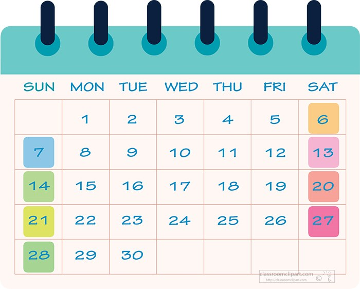
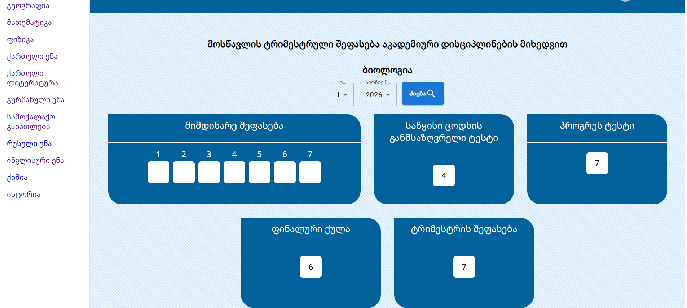
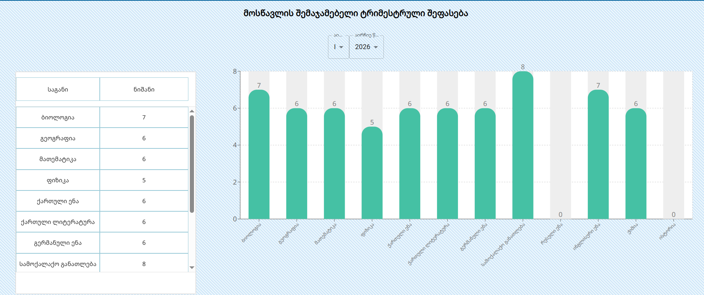
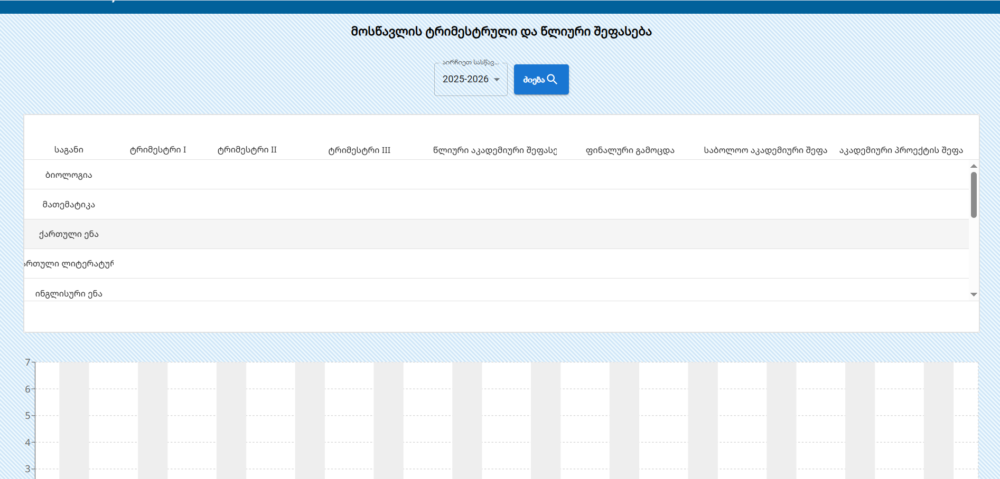
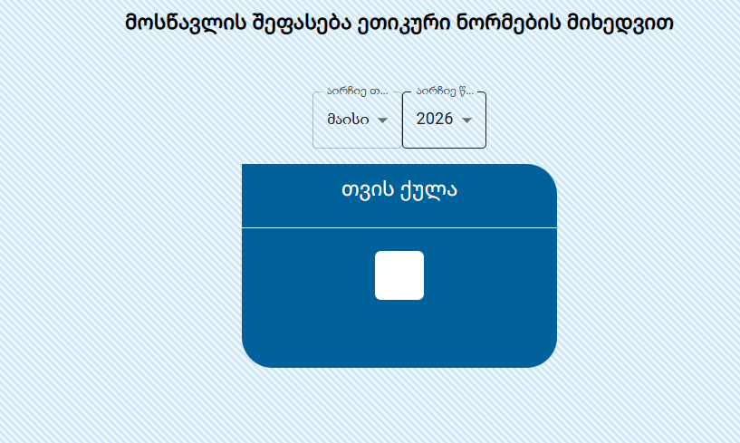

# Client brief — "Electronic Academic Journal 2026" (translated)

Source: `docs/client-brief-2026/original.docx` — *ელ. აკად. ჟურნალი_2026.docx*, supplied by the
client (IB Mtiebi). Full translation below, section by section, in the document's own order.
Georgian terms are kept in parentheses where they are domain vocabulary we will reuse.

Translator's notes are marked **[N]** and are *my* commentary, not the client's words.

> **[N] On "დამკვეთი" (client / customer).** Throughout the document the parent is called the
> *client* — the party who commissions the school's service. Where the original says "sent to the
> client", it means **published to the parent**. This is the same act as today's "close period".

---

## Purpose (untitled opening paragraph)

> The purpose of the electronic journal is, on the one hand, the quality delivery of academic and
> ethical processes at IB Mtiebi and the development of students and academic resources; on the
> other hand, the e-journal is a means of communication with the client, displaying the student's
> academic results by subject and by trimester, the hours the student has missed, and assessments
> against ethical norms. Also homework assignments, news, the student characterization, and — for
> primary school — the daily schedule and meals.

---

## 1. E-journal functionality — *school side* (`/სკოლის მხარე/`)

**1.1 General Director** (გენერალური დირექტორი) — the workspace must display the academic
results, missed hours and ethical assessments of IB Mtiebi's **primary, basic and secondary**
school students, broken down **both by class and by subject**. Also assignments, news, the student
characterization, and — for primary school — the daily schedule and meals.

**1.2 Quality Management and Development Service** (ხარისხის მართვისა და განვითარების სამსახური) —
the workspace must display the academic results of primary, basic and secondary school students,
both by class and by subject, missed hours and ethical assessments, assignments, news, the student
characterization, and — for primary school — the daily schedule and meals.

> **[N]** 1.1 and 1.2 are worded identically; as written these two roles have the same access.

**1.3 School leadership tier** (სკოლის ხელმძღვანელი რგოლი) — the workspace must display **only the
information of the school that constitutes their area of leadership**: student academic results,
missed hours and ethical assessments both by class and by subject, assignments, news, student
characterization, and — for primary school — the daily schedule and meals.

**1.4 Administrator** (ადმინისტრატორი) — the administrator's space covers **all schools'**
information required to administer the e-journal. **The administrator has restricted access to
correcting academic assessments (grades).**

**1.5 Sub-administrator / Coordinator** (ქვეადმინისტრატორი / კოორდინატორი) — the workspace covers
**a single class**, the one they themselves coordinate. The sub-administrator has restricted access
to correcting academic assessments (grades) **once the academic results have been sent to the
client**.

> **[N] This is the whole permission model the brief gives us**, and it is a role hierarchy, not the
> flat permission-group model we have today. Note the scoping axis is now **school → class**
> (primary / basic / secondary are distinct schools), where today we only have class.

---

## 2. Description of the workspace and work processes

**2.1** The Sub-administrator's / Coordinator's workspace is the **list of the class's students**
and information on the **current month's** academic results by subject, assignments, news, the
student characterization, and — for primary school — the daily schedule and meals.

---

## 3. Workspace for **primary school** coordinators

### 3.1 Workspace fields / tabs

1. Daily schedule (დღის რეჟიმი)
2. Meals (კვება)
3. Homework (საშინაო დავალებები)
4. Student characterization (მოსწავლის დახასიათება)
5. Hours missed by the student (მოსწავლის მიერ გაცდენილი საათები)
6. News / Posts (სიახლეები / Posts)

### Daily schedule

A **one-week lesson timetable**, filled in by the coordinator for a specific class.

### Meals

The **week's menu**, filled in by the coordinator.

### Homework

The first page of the tab must display the specific class's academic disciplines.
*Wireframe shows two example subject tiles:* **Georgian** (ქართული) and **Mathematics** (მათემატიკა).

Each subject's page must display the assignments already **sent or saved**, ordered by date, plus an
**"Add" (დამატება)** button for creating a new assignment.

> Saved assignments must be visually distinguishable from sent assignments — e.g. by colour.

*Assignment list wireframe:*

* date-stamped entries — examples `25.10.2026`, `12.10.2026`
* per entry: **disable/deactivate and edit buttons** (გამოსართველი და დასარედაქირებელი ღილაკები)
* **"Add"** button

*New-assignment form wireframe:*

| Field                                     | Georgian                                               |
|-------------------------------------------|--------------------------------------------------------|
| Title                                     | სათაური                                                |
| Assignment body                           | დავალების შინაარსი                                     |
| Text formatting buttons (standard styles) | ტექსტის დასაფორმატებელი ღილაკები (სტანდარტული სტილები) |
| Attach file                               | ფაილის მიმაგრება                                       |
| Select student                            | მოსწავლის არჩევა                                       |
| Select date                               | თარიღის არჩევა                                         |
| **Save**                                  | შენახვა                                                |
| **Send**                                  | გაგზავნა                                               |

> **[N]** "Select student" on an assignment form implies homework can be targeted at an individual
> student, not only at the whole class. Save vs. Send is a **draft → published** state machine.

### Student characterization

The page opens the list of **subjects**, where the **subject teacher** fills in the student's
characterization.

*List wireframe:* student's first and last name + disable/deactivate and edit buttons.

*Form wireframe:*

| Field                                     | Georgian                         |
|-------------------------------------------|----------------------------------|
| Select date                               | თარიღის არჩევა                   |
| Select student                            | მოსწავლის არჩევა                 |
| Student's first and last name             | მოსწავლის სახელი და გვარი        |
| Attach file                               | ფაილის მიმაგრება                 |
| Text formatting buttons (standard styles) | ტექსტის დასაფორმატებელი ღილაკები |
| Characterization body                     | მოსწავლის დახასიათება            |
| **Send**                                  | გაგზავნა                         |
| **Save**                                  | შენახვა                          |

> **[N]** Note the actor shift: the brief says the *subject teacher* writes the characterization,
> whereas §2.1 and everything else in §3 says the *coordinator* fills the tabs in. Needs confirming.

### Hours missed by the student

The class coordinator enters the hours the student missed during the month, **the total number of
academic hours for the month**, and **the permitted number of missed hours**.

Two single-field inputs:

| Georgian                                 | English                            |
|------------------------------------------|------------------------------------|
| თვის აკადემიური საათების სრული რაოდენობა | Total academic hours for the month |
| გაცდენილი საათების დასაშვები რაოდენობა   | Permitted number of missed hours   |

Then a per-student grid — every data column holds *missed hours* (გაცდენილი საათები):

| # | Student surname, name | Sept–Oct | Nov | **Trimester I** | Dec | Jan–Feb | Mar | **Trimester II** | Apr | May | **Trimester III** | **Year** |
|---|-----------------------|----------|-----|-----------------|-----|---------|-----|------------------|-----|-----|-------------------|----------|
| 1 |                       |          |     |                 |     |         |     |                  |     |     |                   |          |
| 2 |                       |          |     |                 |     |         |     |                  |     |     |                   |          |

> A diagram showing the student's absences. **If the missed hours exceed the permitted number, the
> diagram's colour must change** — for example: let it be green, and if exceeded let it become red.

*Wireframe shows a sample readout:* **35 hrs** (35 სთ).

> **[N] The academic calendar is now explicitly three trimesters over 7 reporting periods:**
> Sep–Oct, Nov ⟶ **T1**; Dec, Jan–Feb, Mar ⟶ **T2**; Apr, May ⟶ **T3**; then **Year**.
> The Sep+Oct and Jan+Feb pairings match what the current system already does.

### News / Posts

The coordinator fills in the news fields using **standard post fields** — i.e. the functionality
needed for text and for image upload.

---

## 4. Workspace for **basic and secondary** schools

### 4.1 Workspace fields / tabs

1. Student's trimester assessment (მოსწავლის ტრიმესტრული შეფასება)
2. Student's trimester and final assessment (მოსწავლის ტრიმესტრული და საბოლოო შეფასება)
3. Student's assessment by ethical norms (მოსწავლის შეფასება ეთიკური ნორმების მიხედვით)
4. Hours missed by the student
5. Homework
6. News / Posts

### Student's trimester assessment

Filled in by the coordinator, per the following table.

Header block: **Subject** (საგანი) … **Teacher** (პედაგოგი)

| № | Student surname, name | **Ongoing assessment** (მიმდინარე შეფასება) — 7 columns | *(1 unlabelled column)* | Initial knowledge test | Progress test | Final test | Trimester assessment |
|---|-----------------------|---------------------------------------------------------|-------------------------|------------------------|---------------|------------|----------------------|
| 1 |                       |                                                         |                         |                        |               |            |                      |
| 2 |                       |                                                         |                         |                        |               |            |                      |

Georgian column names: `საწყისი ცოდნის განმსაზღვრელი ტესტი` (initial-knowledge determination test),
`პროგრეს ტესტი` (progress test), `ფინალური ტესტი` (final test), `ტრიმესტრის შეფასება` (trimester
assessment).

> **[N] Ambiguity in the source table.** The header declares 8 cells with "ongoing assessment"
> spanning 7, which totals 14 columns — and the data rows do have 14 cells. That leaves **one
> unlabelled column** sitting between the 7 ongoing slots and the initial-knowledge test. It may be
> an ongoing-assessment average, or a stray cell. **Must be clarified with the client.**
>
> Otherwise this table is exactly what the system does today
> (`TRIMESTER_ONGOING_GRADE_1..7`, `TRIMESTER_INITIAL_KNOWLEDGE_GRADE`, `TRIMESTER_PROGRESS_GRADE`,
> `TRIMESTER_FINAL_EXAM_GRADE`, `TRIMESTER_GRADE`).

### Student's trimester and final assessment

Header block: **Subject** … **Teacher**

| # | Student surname, name | First trimester | Second trimester | Third trimester | Annual academic assessment | Final exam | Overall academic assessment | Academic project assessment |
|---|-----------------------|-----------------|------------------|-----------------|----------------------------|------------|-----------------------------|-----------------------------|
| 1 |                       |                 |                  |                 |                            |            |                             |                             |
| 2 |                       |                 |                  |                 |                            |            |                             |                             |

Georgian: `პირველი ტრიმესტრი`, `მეორე ტრიმესტრი`, `მესამე ტრიმესტრი`,
`წლიური აკადემიური შეფასება`, `ფინალური გამოცდა`, `საბოლოო აკადემიური შეფასება`,
`აკადემიური პროექტის შეფასება`.

> **[N] Two genuinely new columns:** **Overall academic assessment** (distinct from the annual one —
> presumably annual combined with the final exam) and **Academic project assessment**, which has no
> counterpart anywhere in the current system. **No formula is given for any of the derived columns.**

### Student's assessment by ethical norms

Filled in by the coordinator, per the following table:

| # | Student surname, name | Sept–Oct | Nov | **Trimester I** | Dec | Jan–Feb | Mar | **Trimester II** | Apr | May | **Trimester III** | **Year** |
|---|-----------------------|----------|-----|-----------------|-----|---------|-----|------------------|-----|-----|-------------------|----------|
| 1 |                       |          |     |                 |     |         |     |                  |     |     |                   |          |
| 2 |                       |          |     |                 |     |         |     |                  |     |     |                   |          |

> **[N]** This is a **major simplification**. Today ethics is 5 criteria × up to 6 weekly entries
> per month, each with a monthly roll-up (~35 `BEHAVIOUR_*` grade types). The brief asks for **one
> value per month**, plus trimester and year roll-ups. Either the weekly detail is being dropped, or
> the brief only shows the summary view. **Needs confirming — this is a big scope question.**

### Remaining tabs

> The absence, assignment and news fields repeat exactly as used in the primary school.

---

## 5. E-journal functionality — *parent side* (`/მშობლის მხარე/`)

### 5.1 Login fields

* Username (მომხმარებლის სახელი)
* Password (პაროლი)

### 5.2 Main page — tabs presented as buttons

* **Daily schedule** — a table is displayed
* **Meals** — the meal plan / ration is displayed
* **Homework** — assignments sent by the teacher, **in calendar form**.
  Clicking a specific date opens the assignments sent for that date.
  
* **Student characterization**
* **Hours missed by the student** — the number of missed hours is displayed, and a diagram showing
  the student's absences. If the missed hours exceed the permitted number, the diagram's colour must
  change — e.g. green normally, red when exceeded. *(sample readout: **35 hrs**)*
* **News / Posts** — in standard post form

---

## 6. Basic and secondary school *(parent side)*

### 6.1

To the functionality listed above, the academic assessments are added:

* Student's trimester assessment
* Student's trimester and final assessment
* Student's assessment by ethical norms
* Hours missed by the student

The document closes with four screenshots of these screens **as they already exist today** in the
student console:

**Trimester assessment, per subject** — *"მოსწავლის ტრიმესტრული შეფასება აკადემიური დისციპლინების
მიხედვით"*. Subject sidebar, trimester + year pickers, tiles for the 7 ongoing marks, initial
knowledge test, progress test, final mark, trimester assessment.

**Summary trimester assessment** — *"მოსწავლის შემაჯამებელი ტრიმესტრული შეფასება"*. Subject/mark
table plus a bar chart across all subjects.

**Trimester and annual assessment** — *"მოსწავლის ტრიმესტრული და წლიური შეფასება"*. Academic-year
picker; columns: Subject, Trimester I, Trimester II, Trimester III, Annual academic assessment,
Final exam, Overall academic assessment, Academic project assessment — **matching the §4 table**.

**Assessment by ethical norms** — *"მოსწავლის შეფასება ეთიკური ნორმების მიხედვით"*. Month + year
pickers and a single **"month's mark"** (თვის ქულა) tile.

> **[N]** The last screenshot corroborates the simplification above: the parent-facing ethics screen
> is **one number per month**, not the five-criteria weekly breakdown.

---

# Assessment of the brief

**It is a four-page functional outline, not a specification.** It is detailed enough to establish
*scope* and *screen inventory*, and it settles the grading-model question. It is nowhere near
detailed enough to build from without a follow-up round of questions.

## What it settles

* **The trimester model wins.** Three trimesters over 7 reporting periods (Sep–Oct, Nov | Dec,
  Jan–Feb, Mar | Apr, May) plus a Year column. The entire monthly/semester/diagnostics machinery
  documented in `SYSTEM-FUNCTIONALITY.md` §5 is **not mentioned once** — it can go.
* **A role hierarchy replaces the flat permission groups:** General Director, Quality Management
  Service, School Head, Administrator, Coordinator — plus the parent.
* **A new scoping axis:** primary / basic / secondary are separate *schools*, and access is scoped
  school → class. Today we only scope by class.
* **Two views everywhere:** by class and by subject, for the leadership roles.
* **Grade-edit locking is confirmed** as a real requirement (Administrator restricted always;
  Coordinator restricted once results are published to parents).

## What is entirely new — none of it exists today

| Module                                   | Notes                                                                                                                         |
|------------------------------------------|-------------------------------------------------------------------------------------------------------------------------------|
| **Daily schedule** (primary)             | Weekly lesson timetable, coordinator-authored                                                                                 |
| **Meals** (primary)                      | Weekly menu, coordinator-authored                                                                                             |
| **Homework**                             | Per subject, rich text, file attachments, per-student targeting, draft/sent states, date-based; parent side is a **calendar** |
| **Student characterization**             | Per subject, per student, rich text + attachments, draft/sent                                                                 |
| **News / Posts**                         | Text + image upload, standard post model                                                                                      |
| **Primary school** as a whole            | The current system has no notion of it                                                                                        |
| **Academic project assessment**          | New grade column with no defined source                                                                                       |
| **Overall academic assessment**          | New derived column, distinct from the annual one                                                                              |
| **Absence budget + threshold colouring** | Permitted-hours ceiling and green→red diagram                                                                                 |

That is **six new modules** plus a role/multi-school model — considerably more than a rewrite of
what exists. Rich text, file uploads and image uploads alone imply file storage, which the current
system has none of.

## What the brief does *not* say — questions to send back

1. **Grading scale.** Nothing about the point scale, ranges, or the meaning of `ჩთ` / the `-50`
   sentinel we use today. The screenshots show marks of 4–8.
2. **Every derived column's formula.** Trimester assessment, annual academic assessment, overall
   academic assessment, and the trimester/year ethics and absence roll-ups are all shown as columns
   with no rule. Today `TRIMESTER_GRADE` is typed in by hand — is that still intended, or should it
   be computed?
3. **The 14th column** in the trimester table (§4).
4. **Ethics: is the weekly, five-criteria detail being dropped?** This decides whether ~35 grade
   types disappear.
5. **Who writes what.** The brief says the coordinator fills in nearly everything, but student
   characterization is attributed to the subject teacher. Where do ordinary **teachers** fit? They
   are never listed as a role, yet today teachers are the primary grade-entry users.
6. **Publication.** "Once results are sent to the client" is the trigger for locking. Is that
   per class, per subject, per trimester? Who presses it? Does it still send email?
7. **Notifications.** Today closing a period emails every guardian. The brief never mentions email
   or any notification for new homework, posts, or characterizations.
8. **The change-request workflow** (teacher requests a grade change → director approves) is a live,
   substantial feature today and is **not mentioned at all**. Keep, drop, or replace with the
   role-based edit locking?
9. **Excel / Word export** is not mentioned. Today four Excel exports and a Word export exist
   (currently unreachable from the UI). Still needed?
10. **Retention and history** — multi-year access, archived students, class progression year over
    year.
11. Attachment limits, allowed file types, storage location.
12. Whether parents with multiple children get one login or several.

## Recommendation

Send back items 1–8 before any architecture work. Items 1–4 block the data model; 5–6 block the
permission model; both are the parts most expensive to get wrong. Items 9–12 can be resolved
during the build.
